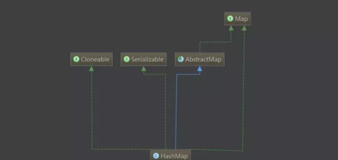

*HashMap是Java中极其频繁的、非常重要的一个集合类，在JDK8改动也比较大，本文主要基于JDK8下HashMap的实现*

#### 源码分析

- 类视图

  

- 类注释
  1. 允许`NULL`值，`NULL`键
  2. 不要轻易改变负载因子，负载因子过高会导致链表过长，查找键值对时间复杂度就会增高，负载因子过低会导致hash桶的 数量过多，空间复杂度会增高
  3. `Hash`表每次会扩容长度为以前的2倍
  4. `HashMap`是多线程不安全的，在`JDK1.7`进行多线程`put`操作，之后遍历，直接死循环，CPU飙到100%，在`JDK 1.8`中进行多线程操作会出现节点和`value`值丢失，为什么`JDK1.7`与`JDK1.8`多线程操作会出现很大不同，是因为`JDK 1.8`的作者对`resize`方法进行了优化不会产生链表闭环。这也是本章的重点之一，具体的细节大家可以去查阅资料。这里就不解释太多了

- 类常量

  ```java
      /**
       * The default initial capacity - MUST be a power of two.
       */
      static final int DEFAULT_INITIAL_CAPACITY = 1 << 4; // aka 16
  
  	 /**
       * The load factor used when none specified in constructor.
       */
      static final float DEFAULT_LOAD_FACTOR = 0.75f;
      /**
       * The bin count threshold for using a tree rather than list for a
       * bin.  Bins are converted to trees when adding an element to a
       * bin with at least this many nodes. The value must be greater
       * than 2 and should be at least 8 to mesh with assumptions in
       * tree removal about conversion back to plain bins upon
       * shrinkage.
       */
      static final int TREEIFY_THRESHOLD = 8;
      /**
       * The smallest table capacity for which bins may be treeified.
       * (Otherwise the table is resized if too many nodes in a bin.)
       * Should be at least 4 * TREEIFY_THRESHOLD to avoid conflicts
       * between resizing and treeification thresholds.
       */
      static final int MIN_TREEIFY_CAPACITY = 64;
      /**
       * The maximum capacity, used if a higher value is implicitly specified
       * by either of the constructors with arguments.
       * MUST be a power of two <= 1<<30.
       */
      static final int MAXIMUM_CAPACITY = 1 << 30;
  ```

- 构造函数

  ```java
  public HashMap(int initialCapacity, float loadFactor) {                                                                   
      if (initialCapacity < 0)
          throw new IllegalArgumentException("Illegal initial capacity: " +
                                             initialCapacity);
      if (initialCapacity > MAXIMUM_CAPACITY)
          initialCapacity = MAXIMUM_CAPACITY;
      if (loadFactor <= 0 || Float.isNaN(loadFactor))
          throw new IllegalArgumentException("Illegal load factor: " + loadFactor);
      this.loadFactor = loadFactor;
      //下面介绍一下这行代码的作用
      this.threshold = tableSizeFor(initialCapacity);
  }
  
  public HashMap(int initialCapacity) {
      this(initialCapacity, DEFAULT_LOAD_FACTOR);
  }
  
  public HashMap() {
      this.loadFactor = DEFAULT_LOAD_FACTOR; // all other fields defaulted
  }
  
  public HashMap(Map<? extends K, ? extends V> m) {
      this.loadFactor = DEFAULT_LOAD_FACTOR;
      putMapEntries(m, false);
  }
  ```

  `HashMap`有4个构造函数.

  重点介绍下`tableSizeFor(initialCapacity)`方法，该方法作用，将你传入的`initialCapacity`进行计算，返回一个大于等于`initialCapacity`最小的`2`的幂次方，比如输入6，结算结果为8，源码如下:

  ```java
  static final int tableSizeFor(int cap) {                                                                      
      int n = cap - 1;
      n |= n >>> 1;
      n |= n >>> 2;
      n |= n >>> 4;
      n |= n >>> 8;
      n |= n >>> 16;
      return (n < 0) ? 1 : (n >= MAXIMUM_CAPACITY) ? MAXIMUM_CAPACITY : n + 1;
  }
  ```

- 插入源码

  ```java
  public V put(K key, V value) {
      return putVal(hash(key), key, value, false, true);
  }
  
  final V putVal(int hash, K key, V value, boolean onlyIfAbsent,                                     
                 boolean evict) {
      Node<K,V>[] tab; Node<K,V> p; int n, i;
      //当table为空时，这里初始化table，不是通过构造函数初始化，而是在插入时通过扩容初始化，有效防止了初始化HashMap没有数据插入造成空间浪费可能造成内存泄露的情况
      if ((tab = table) == null || (n = tab.length) == 0)
          n = (tab = resize()).length;
      //存放新键值对
      if ((p = tab[i = (n - 1) & hash]) == null)
          tab[i] = newNode(hash, key, value, null);
      else {
          Node<K,V> e; K k;
          //旧键值对的覆盖
          if (p.hash == hash &&
              ((k = p.key) == key || (key != null && key.equals(k))))
              e = p;
          //在红黑树中查找旧键值对更新
          else if (p instanceof TreeNode)
              e = ((TreeNode<K,V>)p).putTreeVal(this, tab, hash, key, value);
          else {
              //将新键值对放在链表的最后
              for (int binCount = 0; ; ++binCount) {
                  if ((e = p.next) == null) {
                      p.next = newNode(hash, key, value, null);
                      //当链表的长度大于等于树化阀值，并且hash桶的长度大于等于MIN_TREEIFY_CAPACITY，链表转化为红黑树
                      if (binCount >= TREEIFY_THRESHOLD - 1) // -1 for 1st
                          treeifyBin(tab, hash);
                      break;
                  }
                  //链表中包含键值对
                  if (e.hash == hash &&
                      ((k = e.key) == key || (key != null && key.equals(k))))
                      break;
                  p = e;
              }
          }
          //map中含有旧key，返回旧值
          if (e != null) { 
              V oldValue = e.value;
              if (!onlyIfAbsent || oldValue == null)
                  e.value = value;
              afterNodeAccess(e);
              return oldValue;
          }
      }
      //map调整次数加1
      ++modCount;
      //键值对的数量达到阈值需要扩容
      if (++size > threshold)
          resize();
      afterNodeInsertion(evict);
      return null;
  }
  ```

  上述代码总结如下：

  1. 首次插入进行`hash`表的初始化操作，`扩容`初始化，插入键值对
  2. 插入的键值对中`key`已经存在，更新键值对
  3. 插入链表，如果链表长度大于`MIN_TREEIFY_CAPACITY`（默认值为`8`），转化为红黑树，否则直接插入
  4. 检查是否需要扩容，当键值对的个数大于`threshold`阈值进行扩容操作，其中`threshold=size*loadFactor`

- 扩容

  ```java
  final Node<K,V>[] resize() {
      Node<K,V>[] oldTab = table;
      int oldCap = (oldTab == null) ? 0 : oldTab.length;
      int oldThr = threshold;
      int newCap, newThr = 0;
      //如果旧hash桶不为空
      if (oldCap > 0) {
          //超过hash桶的最大长度，将阀值设为最大值
          if (oldCap >= MAXIMUM_CAPACITY) {
              threshold = Integer.MAX_VALUE;
              return oldTab;
          }
          //新的hash桶的长度2被扩容没有超过最大长度，将新容量阀值扩容为以前的2倍
          else if ((newCap = oldCap << 1) < MAXIMUM_CAPACITY &&
                   oldCap >= DEFAULT_INITIAL_CAPACITY)
              newThr = oldThr << 1; // double threshold
      }
      //如果hash表阈值已经初始化过
      else if (oldThr > 0) // initial capacity was placed in threshold
          newCap = oldThr;
      //如果旧hash桶，并且hash桶容量阈值没有初始化，那么需要初始化新的hash桶的容量和新容量阀值
      else {              
          newCap = DEFAULT_INITIAL_CAPACITY;
          newThr = (int)(DEFAULT_LOAD_FACTOR * DEFAULT_INITIAL_CAPACITY);
      }
      //新的局部变量阀值赋值
      if (newThr == 0) {
          float ft = (float)newCap * loadFactor;
          newThr = (newCap < MAXIMUM_CAPACITY && ft < (float)MAXIMUM_CAPACITY ?
                    (int)ft : Integer.MAX_VALUE);
      }
      //为当前容量阀值赋值
      threshold = newThr;
      @SuppressWarnings({"rawtypes","unchecked"})
      //初始化hash桶
      Node<K,V>[] newTab = (Node<K,V>[])new Node[newCap];
      table = newTab;
      //如果旧的hash桶不为空，需要将旧的hash表里的键值对重新映射到新的hash桶中
      if (oldTab != null) {
          for (int j = 0; j < oldCap; ++j) {
              Node<K,V> e;
              if ((e = oldTab[j]) != null) {
                  oldTab[j] = null;
                  //只有一个节点，通过索引位置直接映射
                  if (e.next == null)
                      newTab[e.hash & (newCap - 1)] = e;
                  //如果是红黑树，需要进行树拆分然后映射
                  else if (e instanceof TreeNode)
                      ((TreeNode<K,V>)e).split(this, newTab, j, oldCap);
                  else { 
                      //如果是多个节点的链表，将原链表拆分为两个链表，两个链表的索引位置，一个为原索引，一个为原索引加上旧Hash桶长度的偏移量       
                      Node<K,V> loHead = null, loTail = null;
                      Node<K,V> hiHead = null, hiTail = null;
                      Node<K,V> next;
                      do {
                          next = e.next;
                          //链表1
                          if ((e.hash & oldCap) == 0) {
                              if (loTail == null)
                                  loHead = e;
                              else
                                  loTail.next = e;
                              loTail = e;
                          }
                          //链表2
                          else {
                              if (hiTail == null)
                                  hiHead = e;
                              else
                                  hiTail.next = e;
                              hiTail = e;
                          }
                      } while ((e = next) != null);
                      //链表1存于原索引
                      if (loTail != null) {
                          loTail.next = null;
                          newTab[j] = loHead;
                      }
                      //链表2存于原索引加上原hash桶长度的偏移量
                      if (hiTail != null) {
                          hiTail.next = null;
                          newTab[j + oldCap] = hiHead;
                      }
                  }
              }
          }
      }
      return newTab;
  }
  ```

  如下情况会产生扩容操作：

  1. 初始化`HashMap`，第一次进行put操作
  2. 当键值对的个数大于`threshold`阀值时产生扩容，`threshold=size*loadFactor`

  源码中关于红黑树的操作、旋转、着色，这里不做介绍，有兴趣可以另行查看

#### 总结

1. `HashMap`允许`NULL`值，`NULL`键
2. 不要轻易改变负载因子，负载因子过高会导致链表过长，查找键值对时间复杂度就会增高，负载因子过低会导致`hash`桶的数量过多，空间复杂度会增高
3. `Hash`表每次会扩容长度为以前的2倍
4. `HashMap`是多线程不安全的，我在`JDK 1.7`进行多线程`put`操作，之后遍历，直接死循环，CPU飙到100%，在`JDK 1.8`中
   进行多线程操作会出现节点和value值丢失，为什么`JDK1.7`与`JDK1.8`多线程操作会出现很大不同，是因为`JDK 1.8`的作者对`resize`
   方法进行了优化不会产生链表闭环。这也是本章的重点之一，具体的细节大家可以去查阅资料。这里就不解释太多了
5. 尽量设置`HashMap`的初始容量，尤其在数据量大的时候，防止多次`resize`
6. `HashMap`在`JDK 1.8`在做了很好性能的提升，我看到过在`JDK1.7`和`JDK1.8 get`操作性能对比`JDK1.8`是要优于`JDK 1.7`的，大家感兴趣的可以自己做个测试。