#### 背景介绍

*线上应用经常收到跨服务间SocketTimeout的异常，服务间的调用设置超时时间为500ms，查看Cat监控发现，发生超时异常都伴随着FGC，并且FGC时间都大于500ms，于是决定dump heap镜像。*

#### 问题定位分析

通过`mat`查看`heap dump`镜像，发现**Finalizer**引用队列在活跃对象占比高达`31.43%`，猜测可能有泄漏。

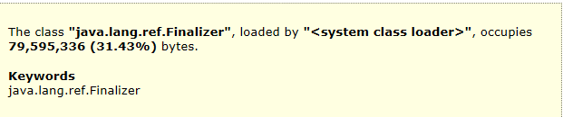

进一步分析发现，**SocksSocketImpl**对象高达`113529`多个，大量的对象都是`Jedis`链接，由此确定`Jedis`可能发生泄漏，同时查看`Old`区空间稳步斜率增长，怀疑对象未充分`YGC`即进入`Old`区，造成下次`FGC`较长的`STW`，引发超时。


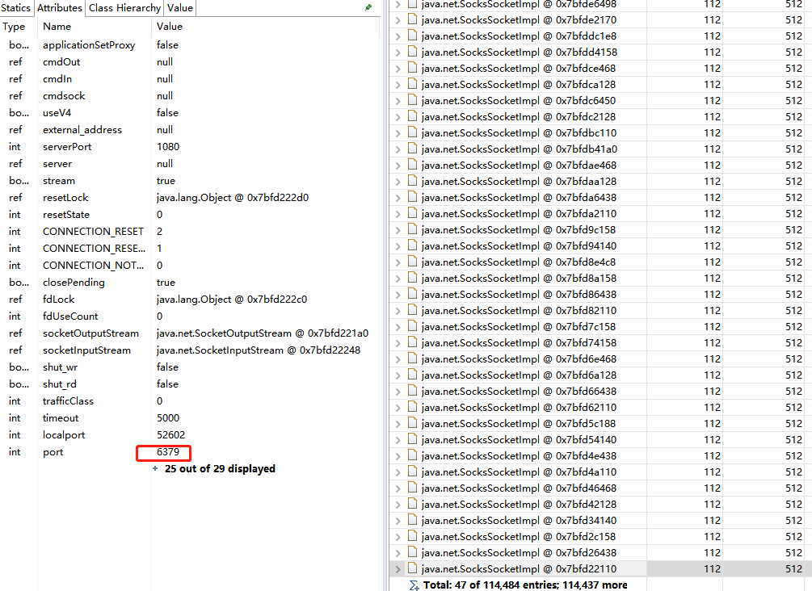

#### GC问题验证

接下来就是验证上述猜测了，通过获取`gc`相关的参数，查看`JVM`各区的容量，发现`S0`和`S1`容量被调整非常小大约`2m`左右，结合收集器配置，情况如下：

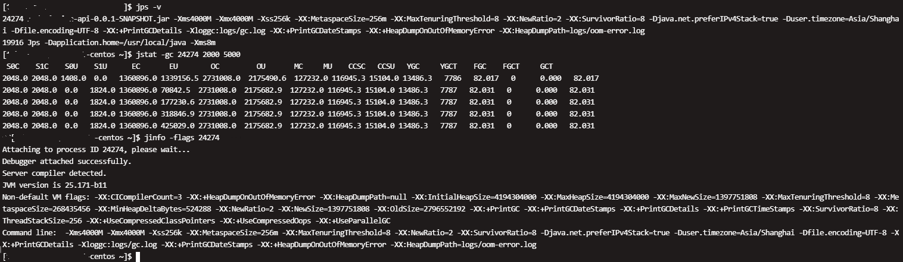

应用采用默认的`PS`和`PO`收集器，并且默认开启`-XX:+UseAdaptiveSizePolicy`，系统会通过吞吐量（`cpu`的`gc`时间）计算，优先保证吞吐量来分配`Eden`，`From`，`To`的`size`，最终导致`S0,S1`区降为`2m`。结合`GC`日志和`Cat`监控，导致`Old`的问题就明朗了，每次`YGC`结束，由于`PS`和`PO`收集器的缘故，`S0`和`S1`区太小无法，导致配置的晋升参数`8`几乎失效，对象晋升过快被拷贝到`Old`区，于是添加`-XX:+PrintTenuringDistribution`上线验证，得到如下大量`GC`日志：

`Desired survivor size 5048576 bytes, new threshold 1 (max 8)` 

#### GC问题调整

上述日志验证猜想，对象由于`S0`和`S1`的`size`太小，晋升过快，问题得到验证，解决就简单了：

1. 更换收集器，`PN+CMS`或者`G1`均可
2. 仍然采用`PS+PO`收集器，关闭`-XX:-UseAdaptiveSizePolicy`，手动设置`Xmn`和`SurvivorRatio`的值

考虑`heap`内存比较小，`4g`左右，根据`R大`的一些分享，采用方案`2`，进行解决，通过`Cat`获取`S0`，`S1`，`Eden`的大小以及`After FGC`后活跃对象的占比，设置对应参数即可，以下来自于美团的设置分享：

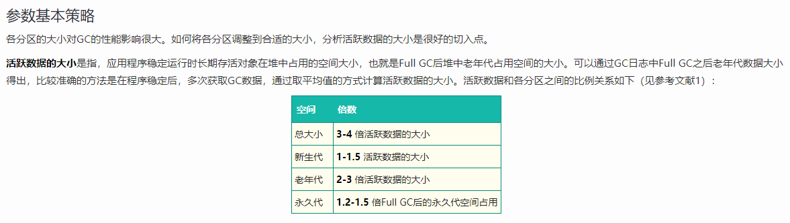

根据项目实际监控情况，我们未完全上述经验值，对项目进行更合适的设置如下：

```markdown
-Xms4G -Xmx4G -Xmn2560M -XX:MetaspaceSize=256M

-XX:-UseAdaptiveSizePolicy

-XX:MaxTenuringThreshold=15 -XX:TargetSurvivorRatio=80 -XX:SurvivorRatio=18
```

#### Jedis问题解决

上述`Jedis`垃圾一方面由于`GC`配置参数不合理导致晋升不合理，查看`Jedis`的连接池的配置，也进行了调整，查看`GenericObjectPool`代码，定时任务检测驱逐对象，关键代码如下：

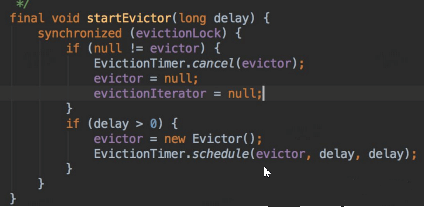

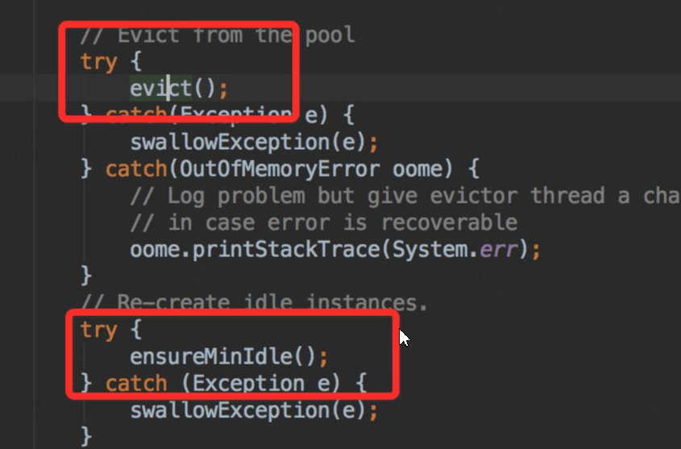

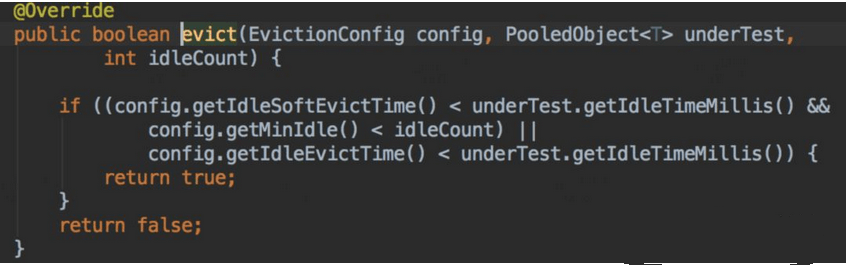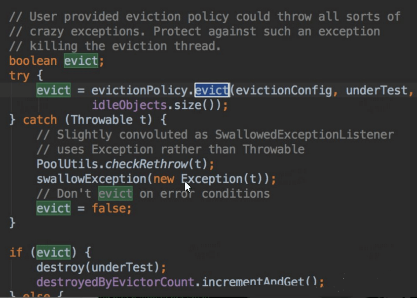

从上面代码我们看出，每隔一段时间，就会检测对象池里面对象，要是发现对象空闲时间超过一定时间，就会强制回收；然后又发现链接少于`minIdle`了，开始创建对象，以满足`mindle`。调整`Redis client` 设置的检测轮询时间为1分钟，设置`miniIdle`为5，修改后上线观察。

#### 调整前后对比：

调整前：

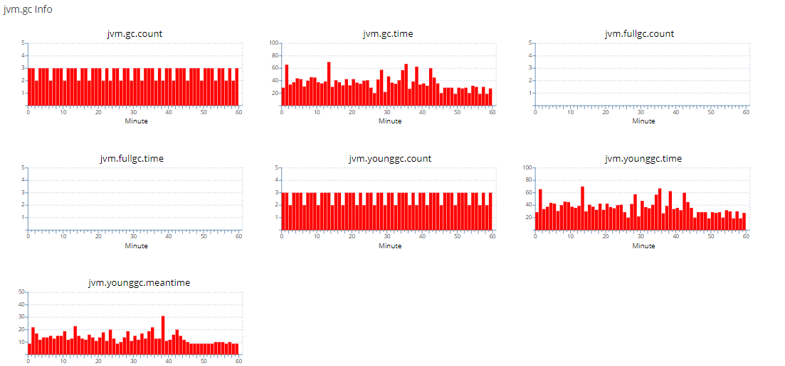

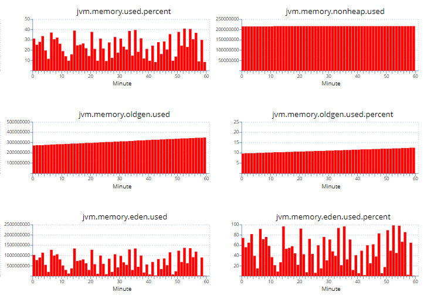

调整后：

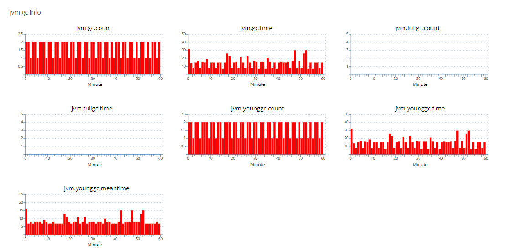

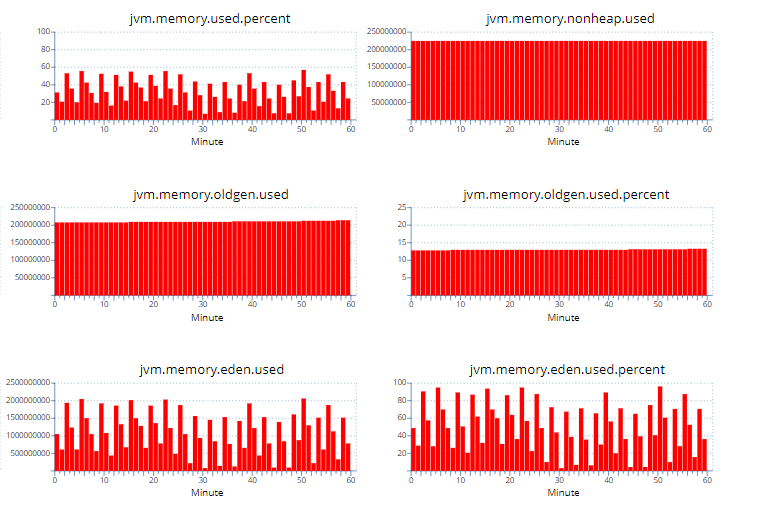

通过上述对比可以看到调整后`YGC`的次数比调整前减半，调整后的`Oldgen`也几乎稳定不增长了，`YGC`由于少了大量的`From`区往`Old`区的拷贝（减少`Survivor`拷贝，`GC`标记较快，主要耗时为拷贝），`YGC`时间耗时大幅下降，`GC`吞吐量获得提升。

#### 参考链接:

[JVM GC 之「AdaptiveSizePolicy」实战](https://www.jianshu.com/p/7414fd6862c5)
