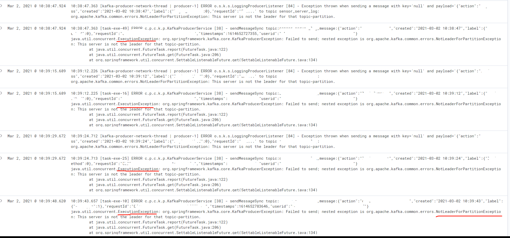
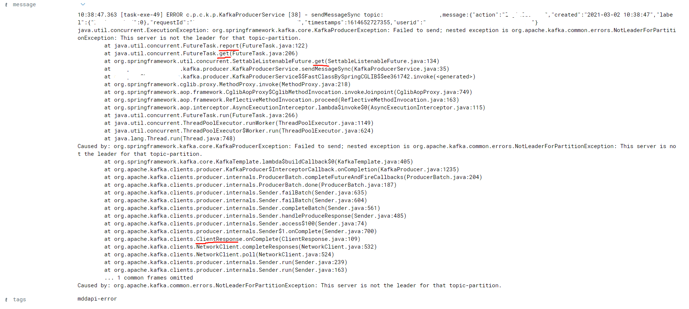

线上Kafka集群由于分区达到上限，出现了选举，ISR列表发生了变更，通过kibana的日志分析：

单个异常栈如下：

消费业务代码如下：

最终Future的超时代码如下：

根据堆栈和日志追踪到这里：

 

kafka阻塞目前会存在两个地方：

1. 首次拉取Metadata会阻塞
2. 由于Kafka的模型，Sender线程会处理RecordAccumulator，收集器的默认大小32M

 

修改方案：

1. acks=1和retries=0参数矛盾，需查看retries代码是否会阻塞，印象中是扔到收集器后返回。
2. 业务调用代码改成异步线程，send方法采用回调函数机制（应对第一次拉取Metadata卡住）
3. 收集器容量塞满，目前是默认60s阻塞

 