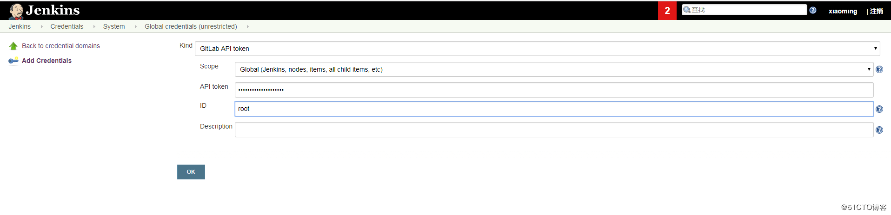
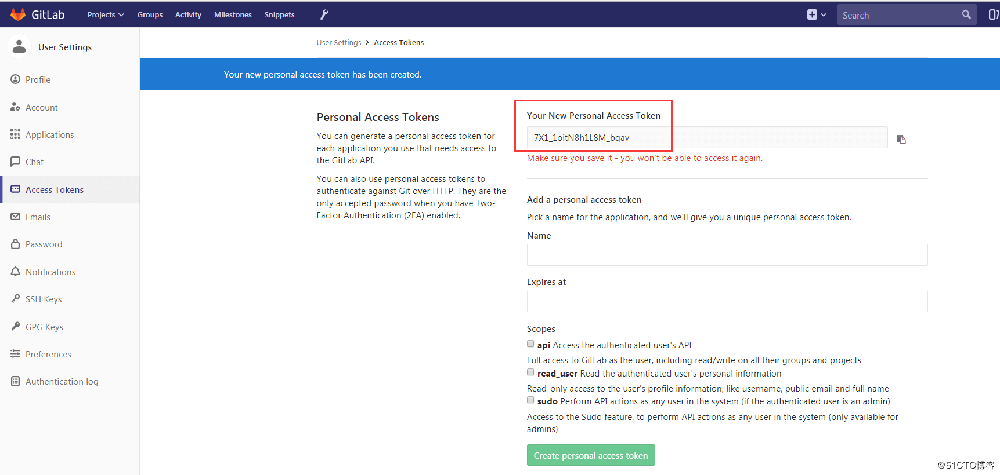
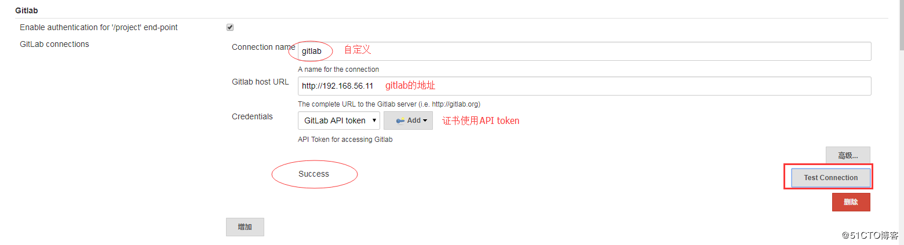
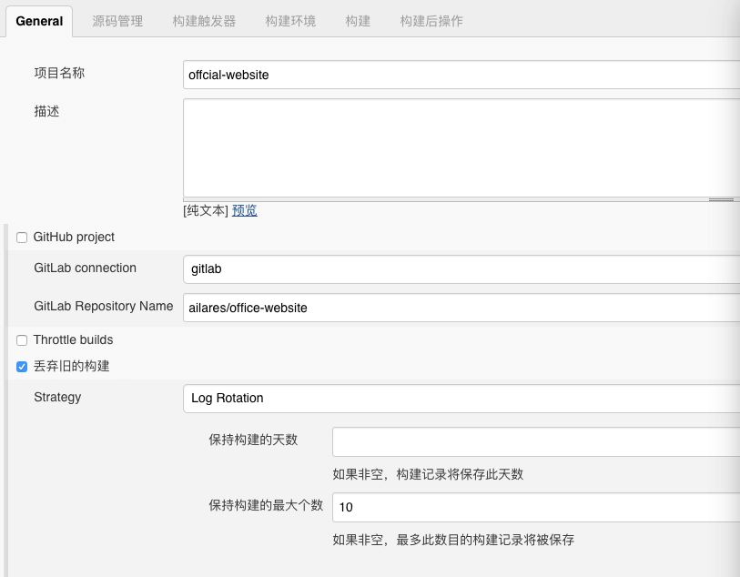
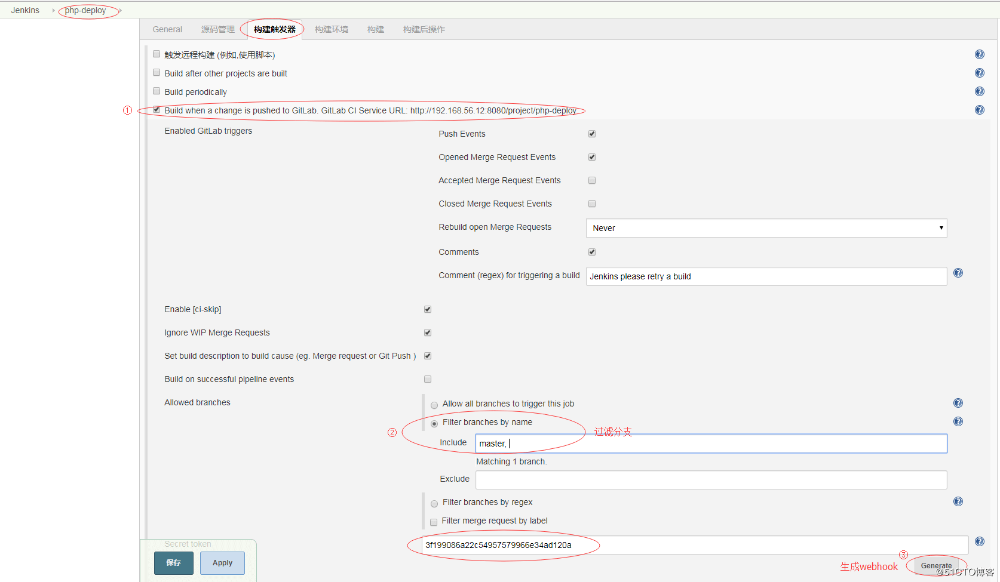
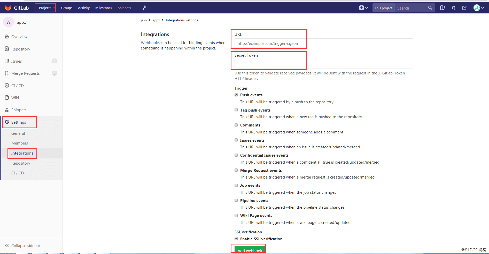

*目前在部署blog之类的静态网站，每次修改完毕后重新部署，略显繁琐，决定通过jenkins+gitlab来进行自动化部署，至于如何安装jenkins+gitlab不是本文重点，可参考我之前的安装博文*

实现自动化的部署原理：`jenkins`通过捕获`gitlab`的`push event`来进行自动部署

#### `Jenkins`和`Gitlab`配置

- 配置`gitlab`认证：

  - 路径：`Jenkins-->Credentials-->System-->Global credentials(unrestricted)-->Add Credentials`
  - `Kind`选择`Gitlab API token`
  - 其中`API token`填写`gitlab`中有指定仓库权限的账号
  - `ID`填写用户账号

  

  

- `Jenkins`配置`gitlab`连接

  - 路径：系统管理-->系统设置
  - 填写连接名，自定义
  - 填写`gitlab`访问`URL`
  - 选择`gitlab`认证
  - 测试连接

  

- `Jenkins`任务配置

  - `General`配置：
    - 选择`Gitlab connection`：`gitlab`（上面步骤配置`gitlab`连接的连接名）
    - 在`Gitlab connection`填入`group/repository name`
  - 构建触发器配置：
    - 勾选`Build when a change is pushed to GitLab. GitLab CI Service URL:http://ip:port/jenkins/project/repository name`
    - 选择`push events` 事件触发构建
    - 选择分支过滤（此处可以根据不同的需求来使用过滤功能）
    - `secret token`后面将会填入`Gitlab`项目中的`webhook`

  

  

- 添加`Gitlab webhook`

  - 在`gitlab`中找到项目—>`setting`—>`Integrations`配置
  - `URL`：填入触发器中配置的`GitLab webhook URL`
  - `Secret Token`:构建器中生成的`Secret Token`
  - 点击`Add webhook`
  - 点击`test`—>选择`push event`进行测试：`Hook excuted successfully：HTTP 200`即为成功

  

- 构建配置

  ```bash
  #!/usr/bin/env bash
  echo ${WORKSPACE}
  
  HTML_PATH=/var/www/html
  NGINX_USER=www-data
  NGINX=/usr/sbin/nginx
  
  # Git archive zip
  cd ${WORKSPACE} && git archive --format zip --output "./output.zip" -0 HEAD
  
  # Delete older and copy newer
  sudo rm -rf ${HTML_PATH} && sudo mkdir -p ${HTML_PATH} && sudo mv ${WORKSPACE}/output.zip ${HTML_PATH}
  
  # Unzip
  cd ${HTML_PATH} && sudo unzip output.zip && sudo chown -R $NGINX_USER:$NGINX_USER $HTML_PATH 
  
  # Nginx
  sudo $NGINX -s reload
  
  # Clean
  sudo rm -rf ${HTML_PATH}/output.zip ${HTML_PATH}/reload-nginx.sh
  ```

#### 参考链接

- [自动化部署之jenkins自动触发构建和发布](http://blog.51cto.com/jinlong/2053863)