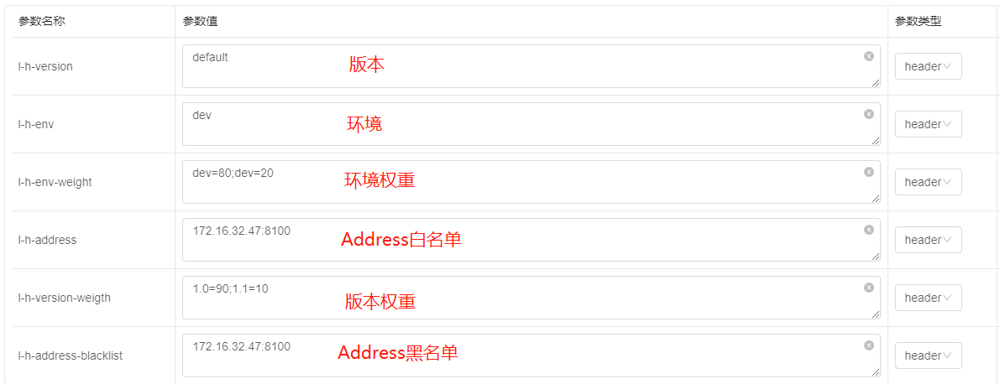

## 概述

#### 元数据定义

```yaml
spring:
  cloud:
    nacos:
      discovery:
        server-addr: 127.0.0.1:8848
        metadata:
          group: mdd
          version: 1.0
          region: region1
          env: env1
          zone: zone1
      config:
        server-addr: 127.0.0.1:8848
        file-extension: yaml
        name: ${spring.application.name}
```

#### Pom引入

- Mdd Dependencies

  ```xml
  <dependencyManagement>
          <dependencies>
              <dependency>
                  <groupId>com.mdd</groupId>
                  <artifactId>mdd-dependencies</artifactId>
                  <version>${version.mdd-dependencies}</version>
                  <type>pom</type>
                  <scope>import</scope>
              </dependency>
  
              <dependency>
                  <groupId>org.springframework.cloud</groupId>
                  <artifactId>spring-cloud-dependencies</artifactId>
                  <version>${version.spring-cloud}</version>
                  <type>pom</type>
                  <scope>import</scope>
              </dependency>
  
              <dependency>
                  <groupId>com.alibaba.cloud</groupId>
                  <artifactId>spring-cloud-alibaba-dependencies</artifactId>
                  <version>${version.spring-cloud-alibaba}</version>
                  <type>pom</type>
                  <scope>import</scope>
              </dependency>
          </dependencies>
  </dependencyManagement>
  ```

- SpringCloud Gateway

  ```xml
  <dependencies>
      <dependency>
          <groupId>com.mdd</groupId>
          <artifactId>mdd-cloud-gateway-starter</artifactId>
      </dependency>
  
      <dependency>
          <groupId>com.mdd</groupId>
          <artifactId>mdd-lily-strategy-mdc-starter</artifactId>
      </dependency>
  
      <!--        <dependency>-->
      <!--            <groupId>com.mdd</groupId>-->
      <!--            <artifactId>mdd-lily-strategy-skywalking-starter</artifactId>-->
      <!--        </dependency>-->
  </dependencies>
  
  ```

- Service

  ```xml
  <dependencies>
      <dependency>
          <groupId>com.mdd</groupId>
          <artifactId>mdd-cloud-servlet-starter</artifactId>
      </dependency>
  
      <dependency>
          <groupId>com.mdd</groupId>
          <artifactId>mdd-lily-strategy-mdc-starter</artifactId>
      </dependency>
  
      <!--        <dependency>-->
      <!--            <groupId>com.mdd</groupId>-->
      <!--            <artifactId>mdd-lily-strategy-skywalking-starter</artifactId>-->
      <!--        </dependency>-->
  </dependencies>
  ```

#### Http Header推送



#### 配置中心推送


