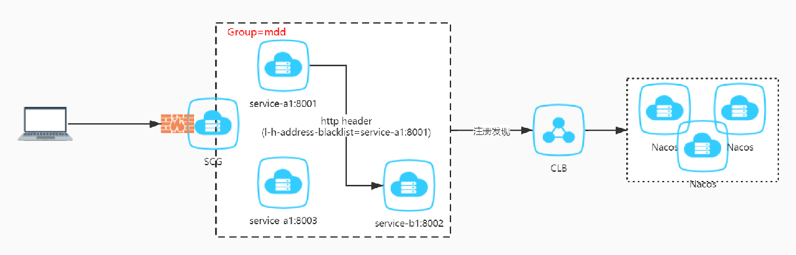

## 概述

#### 核心功能

基于Spring Cloud、Spring Cloud Alibaba服务注册发现，Ribbon负载均衡，Feign和Rest Template调用，Spring Cloud Gateway

- 全链路版本、环境、IP地址和端口匹配动态路由
- 全链路自定义网关、服务的过滤器、负载均衡策略发布
- 全链路条件匹配、非条件匹配
- 服务实时性流量无损下线：IP和端口屏蔽
- 异步场景下全链路追踪和路由：异步跨线程Agent插件
- 全链路调用链追踪、日志监测
- 提供服务端、消费端隔离、注册级别隔离和准入
- 本地和远程，局部和全局配置策略驱动
- 配置中心（Nacos）、Swagger和Rest规则策略推送
- 基于Header参数化规则策略驱动
- 限流、熔断、降级防护

#### 版本兼容列表

| Mdd Dependencies Version | Spring Cloud Version | Spring Cloud Alibaba Version | Spring Boot Version |
| ------------------------ | -------------------- | ---------------------------- | ------------------- |
| 2.0.0                    | Hoxton.SR9           | 2.2.5.RELEASE                | 2.3.8.RELEASE       |

#### 概念介绍

- 滚动发布
  1. 概念：每次滚动升级一个或者多个服务，升级完成后监控观察，直到所有旧版本服务升级到新版本。属于有损发布
  2. 优点：升级快捷，影响范围小，只会影响滚动发布的服务。
  3. 缺点：在滚动升级过程中，无法快速无损回滚，必须降级部署
- 全链路路由

