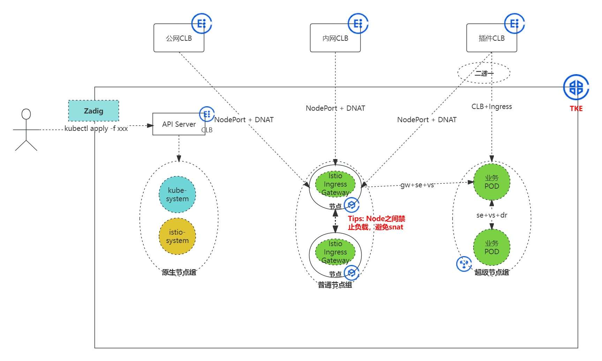
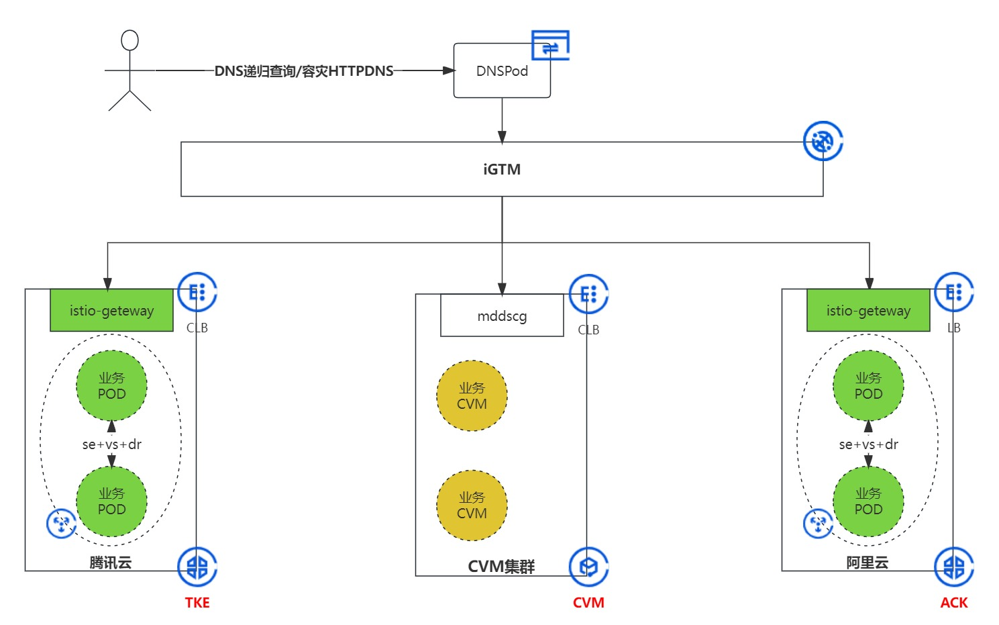

本文主要讨论Istio Ingress Gateway入口方案，网关选型为Istio Ingress Gateway（Envoy网关的一种），部署方式为中心化网关进行部署，在腾讯云落地方式目前主要考虑两种方式：

### CLB复用

- 架构图：

  

- 优点：
  1. 对现有入口调整改动小，可以复用CLB，落地周期短
  2. 可通过CLB规则控制灰度流量到URL粒度
- 缺点：
  1. 需维护CLB和Service NodePort的手动绑定关系，多一层的DNAT开销
  2. 长远来看随着流量的增大超过单CLB入口流量仍需采用GTM方案

### iGTM

- 构架图：
- 优点：
  1. 对现有入口调整改动大，借助DNS负载均衡，实现多CLB共存，长远来看增强入口的扩展性和可用性
  2. 结合HttpDNS可实现入口流量秒级容灾，如果无需秒级可以不用开启（作为纯入口方案也可以不引入）
  3. 借助腾讯云的网关管理控制器可实现CLB与Istio Ingress Gateway的自动绑定关系，方便维护
- 缺点：
  1. 依赖于iGTM和Mesh的SSL证书上浮等产品的稳定性，落地周期长
  2. HttpDNS秒级容灾会产生费用开销，费用成本上升（作为纯入口方案也可以不引入）

另附Envoy Gateway与传统的SpringCloud Gateway对比：

- 优点：
  1. Envoy Gateway相对于Java异步网关更能贴合K8s，与k8s的资源对象结合更紧密
  2. Envoy Gateway在大流量、扩展性、可配置性方面强于Java异步网关
  3. Envoy Gateway是面向未来的网关选型，相信社区会逐步增强和标准化Envoy网关产品以适应更广泛的应用场景
- 缺点
  1. Envoy Gateway在领域认知度和技术栈熟悉方面方面逊于Java异步网关
  2. 基于Envoy Gateway定制化扩展的框架较少，定制化难度目前相对较高

#### 参考链接：

[亲历者复盘：网易的 Envoy 网关选型、开发与改造](https://www.infoq.cn/article/hpu9ifgk71elkapthwun)

[诗和远方：蚂蚁金服 Service Mesh 深度实践 | QCon 实录](https://mp.weixin.qq.com/s?__biz=MzUzMzU5Mjc1Nw==&mid=2247485536&idx=1&sn=06cb9a4228526e5f3072daa7d973aeac&chksm=faa0e7bacdd76eaced58399091d321789ca960ae39129b7d713dba6d54d78063ff9340329db1&token=1568950717&lang=zh_CN&scene=21#wechat_redirect)
