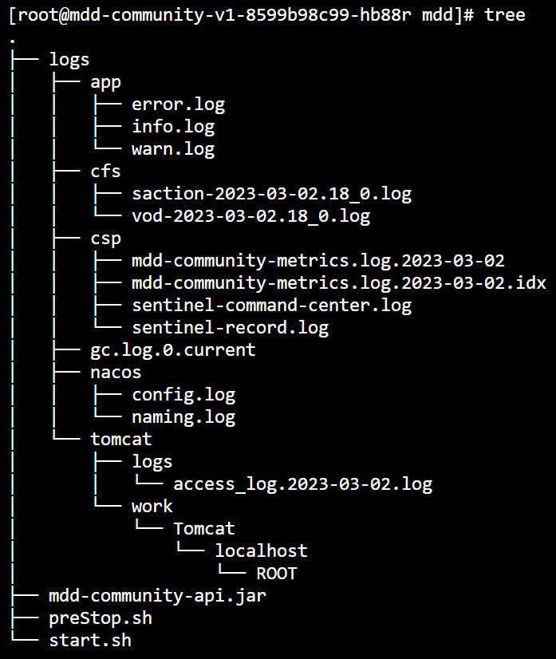

### Mesh改造

#### 镜像

- 容器相关：用于构建镜像，运行容器

  `Dockerfile`

  ```dockerfile
  FROM mdd-images.tencentcloudcr.com/mdd/alijdk:8.8.9_centos
  
  ARG PROJ_DIR=/data/tvbcserver/mdd
  WORKDIR $PROJ_DIR
  
  COPY mdd-community-api.jar $PROJ_DIR
  COPY start.sh $PROJ_DIR
  COPY preStop.sh $PROJ_DIR
  RUN chmod +x start.sh && chmod +x preStop.sh
  
  CMD ["/bin/bash", "-c", "/data/tvbcserver/mdd/start.sh"]
  ```

  `start.sh`

  ```bash
  #!/usr/bin/env bash
  # logs
  [[ -d logs ]] || mkdir logs
  # [[ -d logs/app ]] || mkdir -p logs/app
  # [[ -d logs/cfs ]] || mkdir -p logs/cfs
  # chmod -R 777 logs/mdd-community
  
  # JAVA_OPTS
  if [ -z "$JAVA_OPTS" ];then
    JAVA_OPTS="${JAVA_OPTS} -Xms1g -Xmx1g -Xmn512m -XX:MetaspaceSize=256m -Xss256k"
    JAVA_OPTS="${JAVA_OPTS} -XX:+UseParNewGC -XX:+UseConcMarkSweepGC -XX:+UseCMSInitiatingOccupancyOnly -XX:CMSInitiatingOccupancyFraction=70 -XX:+CMSScavengeBeforeRemark -XX:+ParallelRefProcEnabled"
    JAVA_OPTS="${JAVA_OPTS} -XX:+UseGCLogFileRotation -XX:NumberOfGCLogFiles=10 -XX:GCLogFileSize=100M -XX:+PrintGCDetails -XX:+PrintGCDateStamps -Xloggc:logs/gc.log -XX:+HeapDumpOnOutOfMemoryError -XX:HeapDumpPath=logs/oom-error.hprof"
    JAVA_OPTS="${JAVA_OPTS} -Djava.net.preferIPv4Stack=true -Duser.timezone=Asia/Shanghai -Dfile.encoding=UTF-8 -DJM.LOG.PATH=logs -DJM.SNAPSHOT.PATH=/data/tvbcserver"
  #   JAVA_OPTS="${JAVA_OPTS} -javaagent:/data/tvbcserver/mdd/mddagent/mdd-agent-starter.jar -Dlily.agent.servlet.enabled=true"
  #   JAVA_OPTS="${JAVA_OPTS} -javaagent:/data/tvbcserver/skywalking/agent/skywalking-agent.jar=collector.backend_service=172.16.80.4:11800,agent.service_name=mdd::mdd-community"
  else
    JAVA_OPTS="$JAVA_OPTS"
  fi
  
  # JAVA_ARGS
  if [ -z "$JAVA_ARGS" ];then
    JAVA_ARGS="--spring.cloud.nacos.discovery.metadata.env=dev --feign.mdd.load-balancer.enabled=false"
  else
    JAVA_ARGS="$JAVA_ARGS"
  fi
  
  java $JAVA_OPTS -jar mdd-community-api.jar $JAVA_ARGS
  ```

  `preStop.sh`：用于Lily规则修改，用于打通Nacos的CVM集群

  ```bash
  #!/bin/sh
  
  # console地址
  consoleAddress=$CONSOLE_ADDRESS
  # 应用名称
  appName=$APP_NAME
  # 实例地址
  address=${POD_IP}:${POD_PORT}
  # Nacos 命名空间ID
  nacosNamespaceId=$NACOS_NAMESPACE
  # Nacos Group
  nacosGroup=$NACOS_GROUP
  
  # 随机数
  rand() {
    min=$1
    max=$(($2-$min+1))
    num=$(($RANDOM+1000000000)) #增加一个10位的数再求余
    echo $(($num%$max+$min))
  }
  
  # 加入黑名单
  removeInstance() {
    result=$(curl --location --request POST 'http://'${consoleAddress}'/lily/console/release/lb/remove-instance' --header 'Content-Type: application/json' --data '{
                          "namespaceId":"'${nacosNamespaceId}'",
                          "group":"'${nacosGroup}'",
                          "address":"'${address}'",
                          "serviceId":"'${appName}'"
                     }')
  
    if [ -z "$result" ];then
      echo '第'$1'次调用接口失败'
    else
      echo '第'$1'次调用接口结果：'$result
    fi
  }
  
  # 累计重试次数
  count=1
  
  # 间隔0-500ms
  while true;do
    if [ $count != 1 ]; then
      sleepTime=$(echo "scale=3; $(rand 0 500)/1000" | bc)
      sleep $sleepTime
    fi
  
    # 调用函加入黑名单
    removeInstance $count
  
    # 判断是否成功
    if [ ! -z "$result" ]&&[ $result == true ]; then
      break
    fi
  
    # 累计重试次数
    count=$(($count+1))
  done
  ```

  `Makefile`：用于zadig故障的备用构建

- 业务相关：日志改造和`Sentinel`排除掉探针

  `SentinelUrlcleaner`：探针屏蔽

  ```java
  @Component
  public class MddSentinelUrlCleaner implements UrlCleaner {
      private static final PathMatcher PATH_MATCHER = new AntPathMatcher();
      private static final List<String> IGNORE_URLS = Arrays.asList(
              "/","/error","/actuator/**"
      );
  
      /***
       * <p>Process the url. Some path variables should be handled and unified.</p>
       * <p>e.g. collect_item_relation--10200012121-.html will be converted to collect_item_relation.html</p>
       *
       * @param originUrl original url
       * @return processed url
       */
      @Override
      public String clean(String originUrl) {
          for (String s : IGNORE_URLS) {
              if (PATH_MATCHER.match(s, originUrl)) {
                  return null;
              }
          }
          return originUrl;
      }
  }
  ```

  `logback-spring.xml`：日志改造

  ```xml
  <!-- Logback configuration. See http://logback.qos.ch/manual/index.html -->
  <configuration scan="true" scanPeriod="10 seconds" debug="false">
  
  <!--    k8s专用，主要优先兼容cvm日志，当同时存在cvm和k8s时，无须处理cvm日志清洗和兼容问题-->
  <!--    so, add additional logback-spring.xml, which can make life easy.-->
      <springProperty scope="context" name="contextName" source="spring.application.name" defaultValue="mdd-community"/>
      <springProperty scope="context" name="appDir" source="logback.appDir" defaultValue="logs/app"/>
      <springProperty scope="context" name="cfsDir" source="logback.cfsDir" defaultValue="logs/cfs"/>
      <springProperty scope="context" name="cspDir" source="logback.cspDir" defaultValue="logs/csp"/>
  
      <contextName>${contextName}</contextName>
  
      <property name="FILE_PATTERN" value="%d{HH:mm:ss.SSS} ${CONTEXT_NAME} [%thread] %-5level %logger{5} [%line] | [%X{trace-id}] [%X{span-id}] [%X{l-h-s-group}] [%X{l-h-s-type}] [%X{l-h-s-id}] [%X{l-h-s-address}] [%X{l-h-s-version}] [%X{l-h-s-region}] [%X{l-h-s-env}] [%X{l-h-s-zone}] | %msg%n"/>
  
      <appender name="infoAppender" class="ch.qos.logback.core.rolling.RollingFileAppender">
          <file>${appDir}/info.log</file>
          <rollingPolicy class="ch.qos.logback.core.rolling.SizeAndTimeBasedRollingPolicy">
              <fileNamePattern>${appDir}/info-%d{yyyy-MM-dd}_%i.log</fileNamePattern>
              <maxFileSize>5GB</maxFileSize>
              <maxHistory>3</maxHistory>
              <totalSizeCap>15GB</totalSizeCap>
          </rollingPolicy>
          <encoder>
              <pattern>${FILE_PATTERN}</pattern>
          </encoder>
          <filter class="ch.qos.logback.classic.filter.LevelFilter">
              <level>INFO</level>
              <onMatch>ACCEPT</onMatch>
              <onMismatch>DENY</onMismatch>
          </filter>
      </appender>
  
      <appender name="warnAppender" class="ch.qos.logback.core.rolling.RollingFileAppender">
          <file>${appDir}/warn.log</file>
          <rollingPolicy class="ch.qos.logback.core.rolling.SizeAndTimeBasedRollingPolicy">
              <fileNamePattern>${appDir}/warn-%d{yyyy-MM-dd}_%i.log</fileNamePattern>
              <maxFileSize>1GB</maxFileSize>
              <maxHistory>7</maxHistory>
              <totalSizeCap>5GB</totalSizeCap>
          </rollingPolicy>
          <encoder>
              <pattern>${FILE_PATTERN}</pattern>
          </encoder>
          <filter class="ch.qos.logback.classic.filter.LevelFilter">
              <level>WARN</level>
              <onMatch>ACCEPT</onMatch>
              <onMismatch>DENY</onMismatch>
          </filter>
      </appender>
  
      <appender name="errorAppender" class="ch.qos.logback.core.rolling.RollingFileAppender">
          <file>${appDir}/error.log</file>
          <rollingPolicy class="ch.qos.logback.core.rolling.SizeAndTimeBasedRollingPolicy">
              <fileNamePattern>${appDir}/error-%d{yyyy-MM-dd}_%i.log</fileNamePattern>
              <maxFileSize>1GB</maxFileSize>
              <maxHistory>10</maxHistory>
              <totalSizeCap>10GB</totalSizeCap>
          </rollingPolicy>
          <encoder>
              <pattern>${FILE_PATTERN}</pattern>
          </encoder>
          <filter class="ch.qos.logback.classic.filter.LevelFilter">
              <level>ERROR</level>
              <onMatch>ACCEPT</onMatch>
              <onMismatch>DENY</onMismatch>
          </filter>
      </appender>
  
      <root level="INFO">
          <appender-ref ref="infoAppender"/>
          <appender-ref ref="warnAppender"/>
          <appender-ref ref="errorAppender"/>
      </root>
  
  
  
      <!-- ============================ Vod Begin ============================ -->
      <!-- 点播分集接口请求日志-->
      <appender name="VodAppender" class="ch.qos.logback.core.rolling.RollingFileAppender">
          <rollingPolicy class="ch.qos.logback.core.rolling.SizeAndTimeBasedRollingPolicy">
              <fileNamePattern>${cfsDir}/vod-%d{yyyy-MM-dd.HH}_%i.log</fileNamePattern>
              <maxFileSize>500MB</maxFileSize>
              <maxHistory>72</maxHistory>
              <totalSizeCap>5GB</totalSizeCap>
          </rollingPolicy>
          <encoder>
              <pattern>%d{HH:mm:ss.SSS} %msg%n</pattern>
          </encoder>
      </appender>
  
      <!-- 点播分集接口响应日志-->
      <appender name="SactionAppender" class="ch.qos.logback.core.rolling.RollingFileAppender">
          <rollingPolicy class="ch.qos.logback.core.rolling.SizeAndTimeBasedRollingPolicy">
              <fileNamePattern>${cfsDir}/saction-%d{yyyy-MM-dd.HH}_%i.log</fileNamePattern>
              <maxFileSize>500MB</maxFileSize>
              <maxHistory>72</maxHistory>
              <totalSizeCap>5GB</totalSizeCap>
          </rollingPolicy>
          <encoder>
              <pattern>%d{yyyy-MM-dd HH:mm:ss.SSS} %msg%n</pattern>
          </encoder>
      </appender>
  
      <!--    防盗链异步写入cfs-->
      <appender name="asyncVodAppender" class="ch.qos.logback.classic.AsyncAppender">
          <appender-ref ref="VodAppender"/>
          <neverBlock>true</neverBlock>
          <discardingThreshold>0</discardingThreshold>
          <queueSize>1024</queueSize>
      </appender>
  
      <!--    防盗链异步写入cfs-->
      <appender name="asyncSactionAppender" class="ch.qos.logback.classic.AsyncAppender">
          <appender-ref ref="VodAppender"/>
          <neverBlock>true</neverBlock>
          <discardingThreshold>0</discardingThreshold>
          <queueSize>1024</queueSize>
      </appender>
  
      <logger name="com.pureShare.common.log.VodLog" level="INFO" additivity="false">
          <appender-ref ref="asyncVodAppender"/>
      </logger>
  
      <logger name="com.pureShare.common.log.SactionLog" level="INFO" additivity="false">
          <appender-ref ref="asyncSactionAppender"/>
      </logger>
      <!-- ============================ Vod End ============================ -->
  
      <!-- ============================ Sentinel Begin ============================ -->
      <appender name="sentinelRecordAppender" class="ch.qos.logback.core.rolling.RollingFileAppender">
          <file>${cspDir}/sentinel-record.log</file>
          <rollingPolicy class="ch.qos.logback.core.rolling.SizeAndTimeBasedRollingPolicy">
              <fileNamePattern>${cspDir}/sentinel-record.log.%d{yyyy-MM-dd}_%i</fileNamePattern>
              <maxFileSize>50MB</maxFileSize>
              <maxHistory>7</maxHistory>
              <totalSizeCap>1GB</totalSizeCap>
          </rollingPolicy>
          <encoder>
              <pattern>%d{HH:mm:ss.SSS} [%thread] %-5level %msg%n</pattern>
          </encoder>
      </appender>
  
      <appender name="sentinelCommandCenterAppender" class="ch.qos.logback.core.rolling.RollingFileAppender">
          <file>${cspDir}/sentinel-command-center.log</file>
          <rollingPolicy class="ch.qos.logback.core.rolling.SizeAndTimeBasedRollingPolicy">
              <fileNamePattern>${cspDir}/sentinel-command-center.log.%d{yyyy-MM-dd}_%i</fileNamePattern>
              <maxFileSize>50MB</maxFileSize>
              <maxHistory>7</maxHistory>
              <totalSizeCap>1GB</totalSizeCap>
          </rollingPolicy>
          <encoder>
              <pattern>%d{HH:mm:ss.SSS} [%thread] %-5level %msg%n</pattern>
          </encoder>
      </appender>
  
      <!--    Sentinel异步共用-->
      <appender name="asyncSentinelRecordAppender" class="ch.qos.logback.classic.AsyncAppender">
          <appender-ref ref="sentinelRecordAppender"/>
          <neverBlock>true</neverBlock>
          <discardingThreshold>0</discardingThreshold>
      </appender>
  
      <appender name="asyncSentinelCommandCenterAppender" class="ch.qos.logback.classic.AsyncAppender">
          <appender-ref ref="sentinelCommandCenterAppender"/>
          <neverBlock>true</neverBlock>
          <discardingThreshold>0</discardingThreshold>
      </appender>
  
      <!--    参考Sentinel RecordLogLogger-->
      <logger name="sentinelRecordLogger" level="INFO" additivity="false">
          <appender-ref ref="asyncSentinelRecordAppender"/>
      </logger>
  
      <!--    参考Sentinel CommandCenterLogLogger-->
      <logger name="sentinelCommandCenterLogger" level="INFO" additivity="false">
          <appender-ref ref="asyncSentinelCommandCenterAppender"/>
      </logger>
      <!-- ============================ Sentinel End ============================ -->
  
  </configuration>  
  ```

  

  

#### POD

- `Deployment`描述文件

  ```yaml
  apiVersion: apps/v1
  kind: Deployment
  metadata:
    name: mdd-community-v1
    namespace: prod
    labels:
      app: mdd-community
      version: v1
  spec:
    replicas: 4
    selector:
      matchLabels:
        app: mdd-community
        version: v1
    minReadySeconds: 11
    template:
      metadata:
        labels:
          business: mdd
          app: mdd-community
          version: v1
        annotations:
          # 兼容cvm,绕行端口,迁移完毕,采用subnet
          traffic.sidecar.istio.io/excludeOutboundPorts: 3306,6379,63790,5035,11800,2280
          eks.tke.cloud.tencent.com/cpu: '4'
          eks.tke.cloud.tencent.com/mem: '8Gi'
          eks.tke.cloud.tencent.com/root-cbs-size: '50'
      spec:
        nodeSelector:
          node.kubernetes.io/instance-type: eklet
        initContainers:
          - name: init-skywalking-agent
            image: mdd-images.tencentcloudcr.com/mdd/agents:latest
            command: ['sh', '-c', 'cp -rf /tmp/skywalking /data/tvbcserver/agent/;cp -rf /tmp/mddagent /data/tvbcserver/agent/;']
            volumeMounts:
              - name: ed-agent
                mountPath: /data/tvbcserver/agent
        containers:
          - name: mdd-community
            image: mdd-images.tencentcloudcr.com/prod/mdd-community
            imagePullPolicy: Always
            ports:
              - containerPort: 8101
            env:
              - name: POD_NAMESPACE
                valueFrom:
                  fieldRef:
                    fieldPath: metadata.namespace
              - name: POD_NAME
                valueFrom:
                  fieldRef:
                    fieldPath: metadata.name
              - name: APP_NAME
                valueFrom:
                  fieldRef:
                    fieldPath: metadata.labels['app']
              - name: NACOS_NAMESPACE
                value: ""
              - name: NACOS_GROUP
                value: "mdd"
              - name: POD_IP
                valueFrom:
                  fieldRef:
                    fieldPath: status.podIP
              - name: POD_PORT
                value: "8101"
              - name: CONSOLE_ADDRESS
                value: "prod.istio.mddcloud.com.cn"
              - name: JAVA_OPTS
                value: >-
                  -XX:ActiveProcessorCount=4
                  -Xms4g -Xmx4g -Xmn2g 
                  -XX:MetaspaceSize=256m -Xss256k 
                  -XX:+UseParNewGC -XX:+UseConcMarkSweepGC 
                  -XX:+UseCMSInitiatingOccupancyOnly -XX:CMSInitiatingOccupancyFraction=70 
                  -XX:+CMSScavengeBeforeRemark -XX:+ParallelRefProcEnabled 
                  -XX:+UseGCLogFileRotation -XX:NumberOfGCLogFiles=10 -XX:GCLogFileSize=100M 
                  -XX:+PrintGCDetails -XX:+PrintGCDateStamps -Xloggc:logs/gc.log 
                  -XX:+HeapDumpOnOutOfMemoryError -XX:HeapDumpPath=logs/oom-error.hprof 
                  -Djava.net.preferIPv4Stack=true -Duser.timezone=Asia/Shanghai -Dfile.encoding=UTF-8 
                  -DJM.LOG.PATH=logs -DJM.SNAPSHOT.PATH=/data/tvbcserver 
                  -javaagent:/data/tvbcserver/agent/mddagent/mdd-agent-starter.jar -Dlily.agent.servlet.enabled=true 
                  -javaagent:/data/tvbcserver/agent/skywalking/agent/skywalking-agent.jar=collector.backend_service=172.16.80.4:11800,agent.service_name=mdd::mdd-community-api,agent.sample_n_per_3_secs=1
              - name: JAVA_ARGS
                value: >-
                  --spring.cloud.nacos.discovery.metadata.env=prod
                  --feign.mdd.load-balancer.enabled=false
                  --server.tomcat.accesslog.max-days=3
                  --logging.config=classpath:k8s/logback-spring.xml
            lifecycle:
              preStop:
                exec:
                  command:
                    - /bin/sh
                    - '-c'
                    - /data/tvbcserver/mdd/preStop.sh;exit 0
            startupProbe:
              httpGet:
                path: /actuator/health
                port: 8101
                httpHeaders:
                  - name: Authorization
                    value: Basic bW9uaXRvcjp0dmJjMTIz
              initialDelaySeconds: 50
              periodSeconds: 5
              failureThreshold: 14
            readinessProbe:
              httpGet:
                path: /actuator/health/readiness
                port: 8101
                httpHeaders:
                  - name: Authorization
                    value: Basic bW9uaXRvcjp0dmJjMTIz
              periodSeconds: 5
            volumeMounts:
              - name: ed-agent
                mountPath: /data/tvbcserver/agent
              - name: ed-logs
                mountPath: /data/tvbcserver/mdd/logs
              - name: cfs-logs
                mountPath: /data/tvbcserver/mdd/logs/cfs
                subPathExpr: $(POD_NAMESPACE)/$(APP_NAME)/$(POD_NAME)/cfs
              - name: cfs-logs
                mountPath: /data/tvbcserver/mdd/logs/csp
                subPathExpr: $(POD_NAMESPACE)/$(APP_NAME)/$(POD_NAME)/csp
          - name: filebeat
            image: mdd-images.tencentcloudcr.com/mdd/mdd-filebeat:latest
            imagePullPolicy: Always
            securityContext:
              runAsUser: 0
            env:
              - name: POD_NAMESPACE
                valueFrom:
                  fieldRef:
                    fieldPath: metadata.namespace
              - name: POD_NAME
                valueFrom:
                  fieldRef:
                    fieldPath: metadata.name
              - name: POD_IP
                valueFrom:
                  fieldRef:
                    fieldPath: status.podIP
            volumeMounts:
              - name: cm-filebeat
                mountPath: /opt/filebeat_logs/filebeat.yml
                subPath: filebeat.yml
                readOnly: true
              - name: ed-logs
                mountPath: /data/tvbcserver/mdd/logs
        volumes:
          - name: cm-filebeat
            configMap:
              name: cm-filebeat-community
          - name: ed-agent
            emptyDir: {}
          - name: ed-logs
            emptyDir: {}
          - name: cfs-logs
            persistentVolumeClaim:
              claimName: pvc-cfs
  ```

- `Pod`依赖文件：

  1. `ConfigMap`：`filebeat.yml`
  2. `PV/PVC`：`cfs`引用`pv/pvc`
  3. `EnvoyFilter`：`Sidecar`基座修改`Tcp`
  4. `Istio IngressGateway`：`gateway`和`virtualservice`修改
  5. `Nacos2Istio`：迁移期间，新增服务需配置同步任务

#### Zadig

- 构建：脚本、缓存、构建容器

  ```bash
  #!/bin/bash
  set -e
  
  PROJ_DIR=$WORKSPACE/Mdd_AppApi
  
  # Maven
  cd $PROJ_DIR
  mvn clean package -Pa-community,prod -DskipTests
  
  # Docker
  TARGET=$PROJ_DIR/target
  DOCKER=$PROJ_DIR/docker/community
  DOCKER_TMP=$TARGET/docker_tmp
  [[ -d $DOCKER_TMP ]] || mkdir -p $DOCKER_TMP
  
  cp $DOCKER/Dockerfile $DOCKER_TMP
  cp $DOCKER/preStop.sh $DOCKER_TMP
  cp $DOCKER/start.sh $DOCKER_TMP
  cp $TARGET/mdd-community-api.jar $DOCKER_TMP
  # cp $TARGET/mdd-community.jar $DOCKER_TMP && cd $DOCKER_TMP && jar -xf mdd-community.jar
  ```

- 发布

  1. 建立`zadig`服务，以`Deployment`为核心，位于`mdd-k8s-deploy`代码仓库
  2. 建立`zadig`环境，关联`namespace`和`tcr`镜像仓库
  3. 建立`zadig`工作流，关联对应的服务和环境
