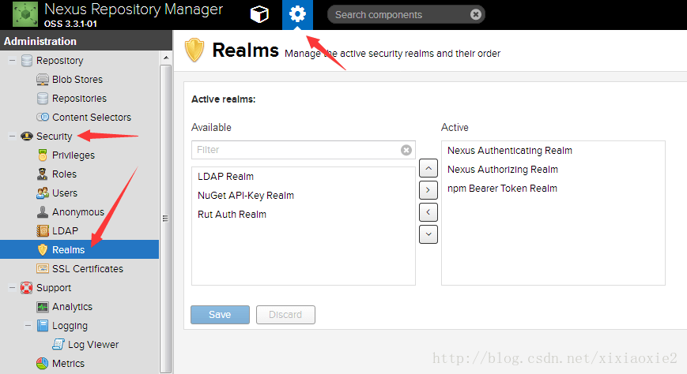

nexus是可以搭建maven，npm，docker，pypi私有仓库的工具，本文记录npm的安装配置

#### 配置nexus的npm

- 添加认证：按图示进入realms设置页，将npm Bearer Token Realm加入active即可。

  


- npm-taobao-proxy

  ```
  Remote storage:https://registry.npm.taobao.org/
  Use the Nexus truststore:勾选
  Blob store:npm
  ```

- npm-3rd-hosted

  ```
  Blob store:npm
  Deployment policy: Allow redeploy
  ```

- npm-group(注意Members顺序)

  ```
  Blob store:npm
  Members:
  - npm-3rd-hosted
  - npm-taobao-proxy
  ```

#### 配置本地npm

- 用户级别配置
  
- `~/.npmrc(若没有需要新建)`
  
- `.npmrc`配置如下：

  ```
  registry = http://ip:port/nexus/repository/npm-group/
  ```

#### 参考链接

- [nexus搭建npm私服](https://blog.csdn.net/xixiaoxie2/article/details/72492085)

