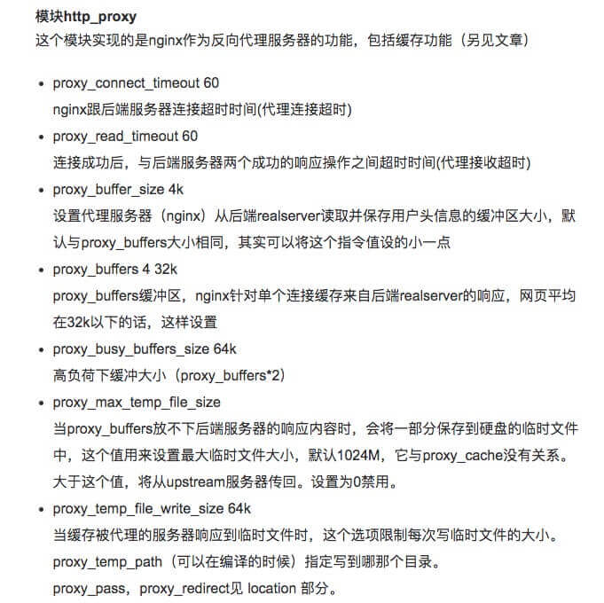

*Web服务器经常会使用nginx作前置路由，在使用nginx配置Web服务器负载均衡、动静分离，会碰到设置反向代理后导致前端资源无法加载的问题*

nginx反向代理的tomcat服务器导致前端资源css或js加载失败大概可以分为：端口丢失、真实ip或端口获取错误、js或者css太大加载失败等情形

#### 端口丢失

- 之前笔者也有文章单独介绍，可参考[nginx转发丢失端口的问题](http://flyflyfish.com/2018/02/24/nginx%E8%BD%AC%E5%8F%91%E4%B8%A2%E5%A4%B1%E7%AB%AF%E5%8F%A3%E9%97%AE%E9%A2%98/)

---

#### 反向代理获取真实ip（域名）、端口、协议

nginx反向代理后，servlet应用通过request.getRemoteAddr()取到的IP是nginx的IP，并非客户端的真实IP；通过request.getRequestUrl()获取的ip（域名）、端口、协议都是nginx对应的参数。

- 比如nginx的配置：

```nginx
http {
    upstream backend {
        server 127.0.0.1:8080;
        #server backend1.example.com wight=5;
        #server 127.0.0.1:8080 max_fails=3 fail_timeout=30s;
        
        #server backup1.example.com backup;
    }
    
    server {
        listen 80;
        server_name your.domain.com;
        
        location /test {
            proxy_pass http://backend/test;
        }
        ...
    }
}
```

在浏览器打开`http://your.domain.com/test`访问servlet应用，获取客户端IP和URL：

```java
log.info("RemoteAddr:{}, URL:{}", request.getRemoteAddr(), request.getRequestURL());
//输出结果
RemoteAddr:127.0.0.1, URL:http://127.0.0.1:8080/test
```

- 针对tomcat+nginx的解决方案：

  nginx添加如下配置,：

  ```nginx
  proxy_set_header Host $http_host;
  proxy_set_header X-Real-IP $remote_addr;
  proxy_set_header X-Forwarded-For $proxy_add_x_forwarded_for;
  proxy_set_header X-Forwarded-Proto $scheme;
  ```

  如果不知道如何添加，可参考[nginx转发丢失端口的问题](http://flyflyfish.com/2018/02/24/nginx%E8%BD%AC%E5%8F%91%E4%B8%A2%E5%A4%B1%E7%AB%AF%E5%8F%A3%E9%97%AE%E9%A2%98/)。添加完后，输出结果如下：

  ```java
  //输出结果
  RemoteAddr:127.0.0.1, URL:http://浏览器的ip地址/test
  ```

  发现RemoteAddr仍然获取不正确，解决方案如下：

  - 方案一：通过`request.getHeader("X-Forwrad-For")`或`request.getHeader("X-Real-IP")`获取到nginx配置的Header。

  - 方案二： 配置tomcat，通过Servlet API的request.getRemoteAddr()方法获取客户端的IP。Tomcat的server.xml，在Host元素内最后加入：

    ```xml
    <Valve className="org.apache.catalina.valves.RemoteIpValve" />
    ```

  ---

  #### JS或css无法完全加载

  nginx的代理缓存区，默认较小导致部分文件出现加载不全的问题，比较典型的如`jQuery框架`，可以通过配置调整nginx的缓存区即可。

  最终完整配置如下：

  ```nginx
  http {
      # http_proxy 
      proxy_buffer_size 128k;
      proxy_buffers 32 128k;
      proxy_busy_buffers_size 128k;
      
      upstream backend {
          server 127.0.0.1:8080;
      }
      
      server {
          listen 80;
          server_name your.domain.com;
          
          location /test {
              proxy_pass http://backend/test;
              # proxy_params
              proxy_set_header Host $http_host;
              proxy_set_header X-Real-IP $remote_addr;
              proxy_set_header X-Forwarded-For $proxy_add_x_forwarded_for;
              proxy_set_header X-Forwarded-Proto $scheme;
          }
          ...
      }
      ...
  }
  ```

  关于`nginx`的`http_proxy`模块参数含义：

  


- 参考链接：
  - [nginx tomcat负载均衡、动静分离](https://lanjingling.github.io/2015/10/28/nginx-tomcat-cluster/)
  - [Nginx+Tomcat代理环境下JS无法完全加载问题的处理](http://www.zving.com/c/2014-03-19/257610.shtml)
  - [Jetty/Tomcat + Nginx反向代理获取客户端真实IP、域名、协议、端口](http://blog.csdn.net/xiao__gui/article/details/73733797)
  - [nginx基本使用系列(三)_nginx常用配置文件解析](https://www.jianshu.com/p/5c7d718f15d2)

