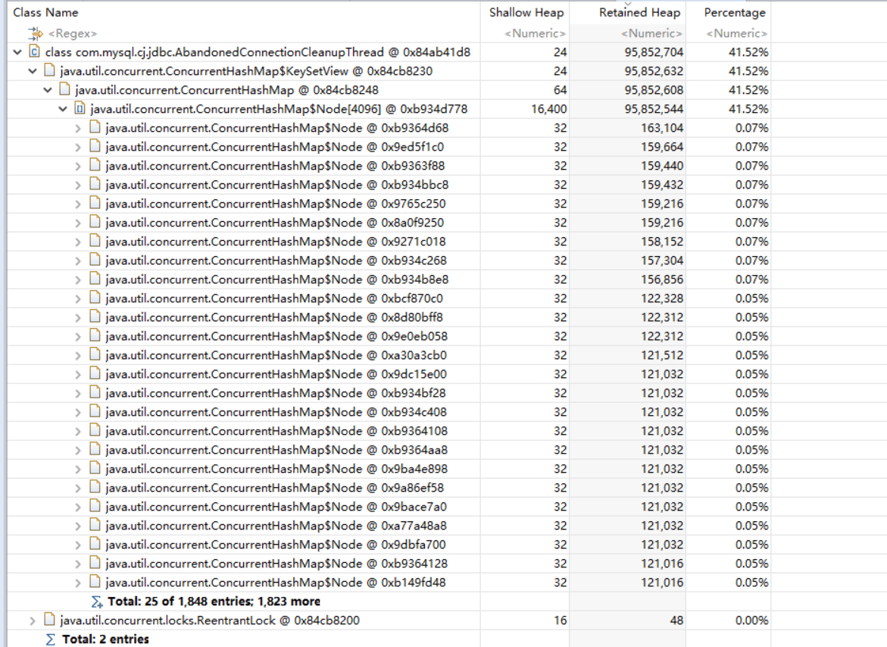
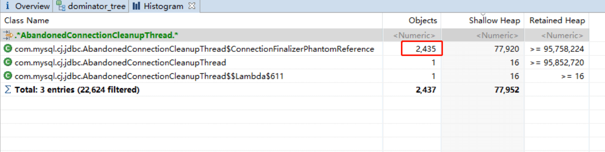
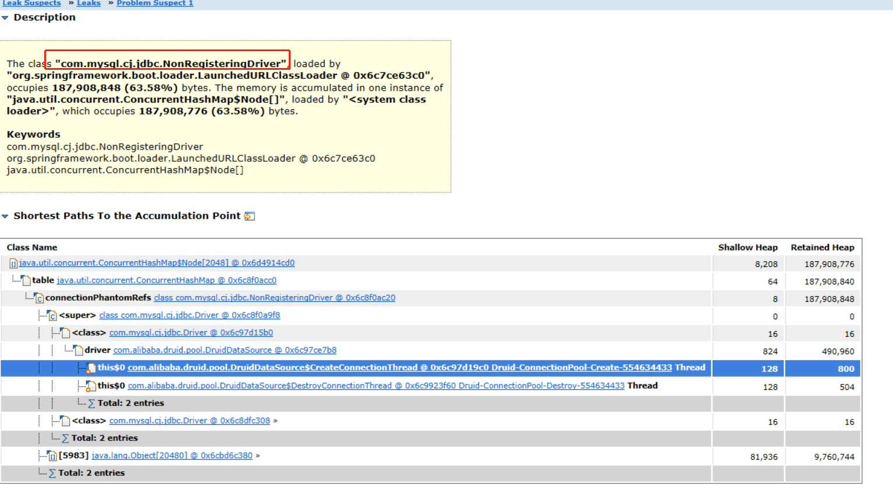
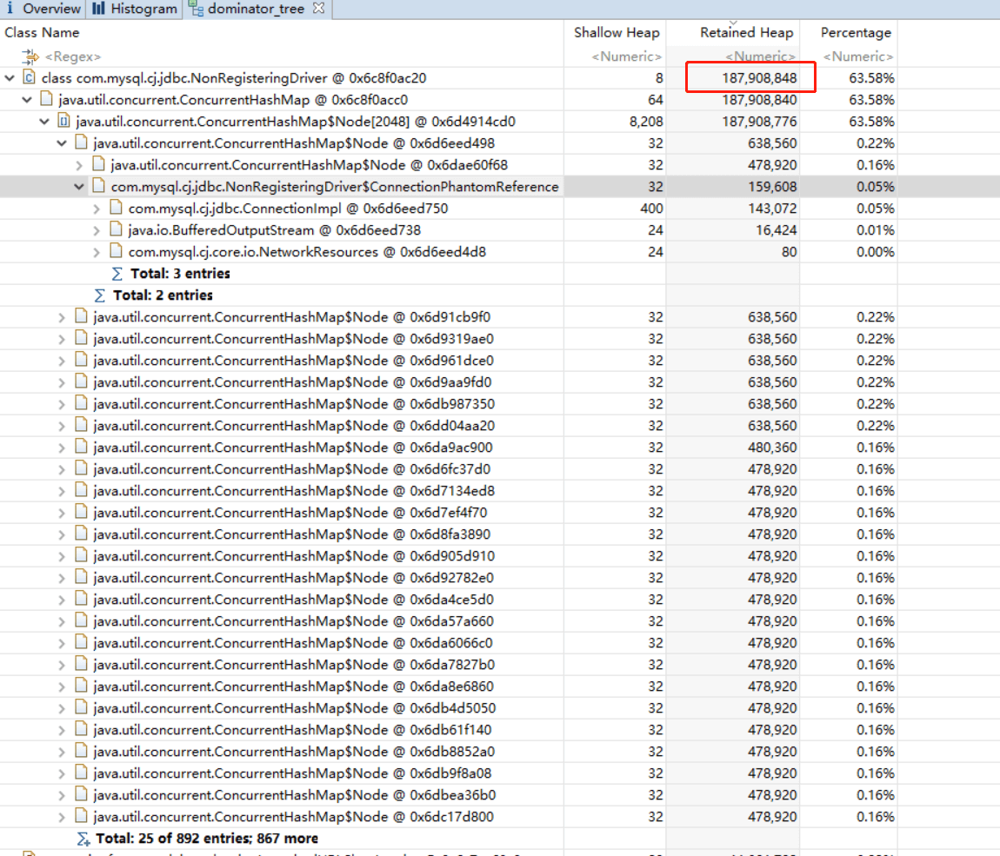

*线上出现FGC占用时间过长的告警，查看GC日志确认FGC达到3.84s*

1. #### 问题描述

通过mat分析dump下来的日志发现，com.mysql.cj.jdbc.AbandonedConnectionCleanupThread 对象占了堆内存的大部分空间.

查看对象是com.mysql.cj.jdbc.AbandonedConnectionCleanupThread$ConnectionFinalizerPhantomReference（mysql的connection清理的虚引用）对象堆积达到2435个，初步判断长时间gc的问题是由于ConnectionFinalizerPhantomReference堆积引起的，该应用采用hikari的datasource.

同样选了一台采用druid的datasource的应用，也发现同样问题：

**其中com.mysql.cj.jdbc.NonRegisteringDriver堆积对象达到1188个**

#### 2. **问题分析**

基本可以确定是mysql driver连接弱引用的问题，两个问题可以合并为同一个问题，其中mysql清理源代码这里略过不表，有兴趣可以去查看NonRegisteringDriver中connectionPhantomRefs的添加和清理逻辑。

这里结合项目中**hikaricp**数据配置和官方文档结合说明，Druid同理。

 

查阅hikaricp数据池的[官网地址](https://github.com/brettwooldridge/HikariCP)，看看部分属性介绍如下：

**maximumPoolSize**

> This property controls the maximum size that the pool is allowed to reach, including both idle and in-use connections. Basically this value will determine the maximum number of actual connections to the database backend. A reasonable value for this is best determined by your execution environment. When the pool reaches this size, and no idle connections are available, calls to getConnection() will block for up to connectionTimeout milliseconds before timing out. Please read about pool sizing. Default: 10

maximumPoolSize控制最大连接数，默认为10

**minimumIdle**

> This property controls the minimum number of idle connections that HikariCP tries to maintain in the pool. If the idle connections dip below this value and total connections in the pool are less than maximumPoolSize, HikariCP will make a best effort to add additional connections quickly and efficiently. However, for maximum performance and responsiveness to spike demands, we recommend not setting this value and instead allowing HikariCP to act as a fixed size connection pool. Default: same as maximumPoolSize

minimumIdle控制最小连接数，默认等同于maximumPoolSize，10。

**⌚idleTimeout**

> This property controls the maximum amount of time that a connection is allowed to sit idle in the pool. This setting only applies when minimumIdle is defined to be less than maximumPoolSize. Idle connections will not be retired once the pool reaches minimumIdle connections. Whether a connection is retired as idle or not is subject to a maximum variation of +30 seconds, and average variation of +15 seconds. A connection will never be retired as idle before this timeout. A value of 0 means that idle connections are never removed from the pool. The minimum allowed value is 10000ms (10 seconds). Default: 600000 (10 minutes)

连接空闲时间超过idleTimeout（默认10分钟）后，连接会被抛弃

**⌚maxLifetime**

> This property controls the maximum lifetime of a connection in the pool. An in-use connection will never be retired, only when it is closed will it then be removed. On a connection-by-connection basis, minor negative attenuation is applied to avoid mass-extinction in the pool. We strongly recommend setting this value, and it should be several seconds shorter than any database or infrastructure imposed connection time limit. A value of 0 indicates no maximum lifetime (infinite lifetime), subject of course to the idleTimeout setting. Default: 1800000 (30 minutes)

连接生存时间超过 maxLifetime（默认30分钟）后，连接会被抛弃.

回头看看**项目的hikari配置**：

.png)

- 配置了minimumIdle = 10，maximumPoolSize = 10，没有配置idleTimeout和maxLifetime。所以这两项会使用默认值 idleTimeout = 10分钟，maxLifetime = 30分钟。

- 假如数据库连接池已满，有10个连接，假如系统空闲(没有连接会在10分钟后（超过idleTimeout）被废弃)；假如系统一直繁忙，10个连接会在30分钟后（超过maxLifetime）后被废弃。

- **猜测问题产生的根源：**

  每次新建一个数据库连接，都会把连接放入connectionPhantomRefs集合中。数据连接在空闲时间超过idleTimeout或生存时间超过maxLifetime后会被废弃，在connectionPhantomRefs集合中等待回收。由于连接资源一般存活周期长，经过多次Young GC,一般都能存活到老年代。如果这个数据库连接对象晋升到老年代，connectionPhantomRefs中的元素就会一直堆积，直到下次 full gc。如果等到full gc 的时候connectionPhantomRefs集合的元素非常多，那么该次full gc就会非常耗时。

#### 3. **问题验证**

1. 线上模拟环境(待测试）

 为了验证问题，可以模拟线上环境，调整maxLifetime等参数~**压测思路如下**：

- 1.缓存系统模拟线上的配置，使用压测系统一段时间内持续压缓存系统，使缓存系统短时间创建/废弃大量数据库连接，观察 connectionPhantomRefs对象是否如期大量堆积，手动触发FGC，观察 connectionPhantomRefs对象是否被清理。
- 2.调整maxLifetime 参数，观察相同的压测时间内 connectionPhantomRefs对象是否还发生堆积

2. 不过可以结合GC日志分析：

 再结合我们生产的问题，假设我们每天14个小时高峰期(12:00 ～ 凌晨2:00)，期间连接数10，10个小时低峰期，期间连接数10，每次 full gc 间隔4天，等到下次 full gc 堆积的 NonRegisteringDriver 对象为 10 * 24 * 2 * 4 = 1920，与问题dump里面connectionPhantomRefs对象的数量2435个基本吻合。

#### 4. 问题解决方案

由上面分析可知，问题产生的根源是废弃的数据库连接对象堆积，最终导致 full gc 时间过长。可以从以下几个方面入手解决方案：

- 1、减少废弃的数据连接对象的产生和堆积。
- 2、优化full gc时间.

**【调整hikari参数】（待测试）**

可以考虑设置 maxLifetime 为一个较大的值，用于延长连接的生命周期，减少产生被废弃的数据库连接的频率，等到下次 full gc 的时候需要清理的数据库连接对象会大大减少。

Hikari 推荐 maxLifetime 设置为比数据库的 wait_timeout 时间少 30s 到 1min。如果使用的是 mysql 数据库，可以使用 show global variables like '%timeout%'; 查看 wait_timeout，腾讯云默认为 1 小时。

1. 下面开始验证，设置maxLifetime = 55分钟，其他条件不变。压测启动前观察jvisualvm，connectionPhantomRefs对象数量
2. 1000s后，观察 connectionPhantomRefs对象

看看connectionPhantomRefs对象没有发生堆积

**同时另外注意**：minimumIdle和maximumPoolSize不要设置得太大，一般来说配置minimumIdle=10，maximumPoolSize=10～20即可。

我们这次问题产生的根源是数据库连接对象堆积，导致full gc时间过长。解决思路可以从以下三点入手：

- 1、调整hikari配置参数。例如把maxLifetime设置为较大的值（比数据库的wait_timeout少30s），minimumIdle和maximumPoolSize值不能设置太大，或者直接采用默认值即可。
- 2、采用G1垃圾回收器？（G1可以自定义STW时间，但R大推荐8g为分界线，8g以下CMS比较推荐）。
- 3、建立巡查系统，在业务低峰期主动触发full gc。