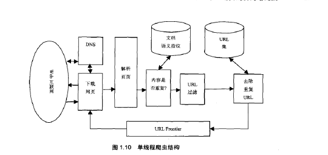

*一个设计良好的爬虫必须满足如下需求：*

- 分布式：多机分布式执行
- 可伸缩性：爬虫结构能够通过额外的机器和带宽来提交爬虫速度
- 性能和有效性：爬虫系统必须有效使用各种系统资源，例如Cpu，内存和网络IO
- 更新：因为数据来源经常更新，爬虫应该取得已经获取数据的新的拷贝
- 可扩展性：为了能够支持新的数据格式和新的抓取协议，爬虫架构应该设计成模块化的形式

#### 爬虫模块

- URL Frontier(url队列)
- DNS模块
- 获取模块（使用http协议获取url代表的数据或页面）
- 解析模块提取api数据
- 重复消除模块决定一个解析出来的链接是否已经在URL Frontier或者最近下载过

